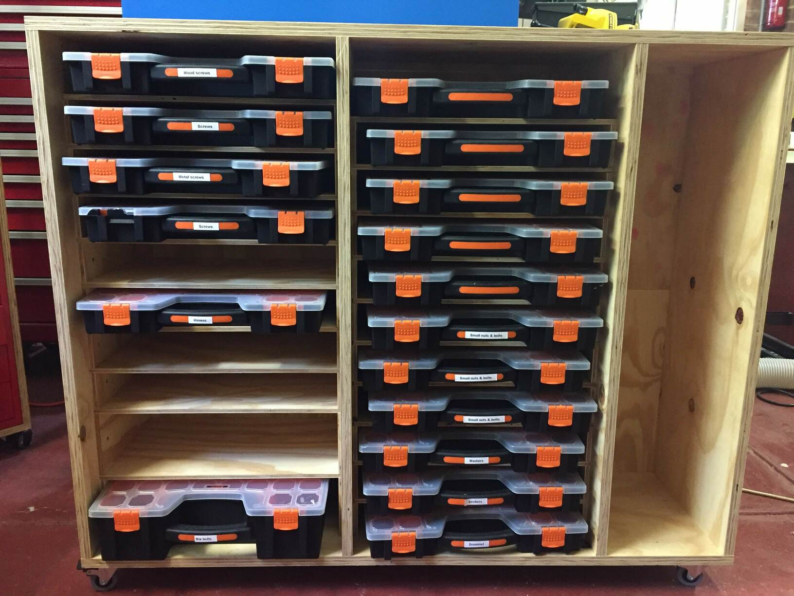
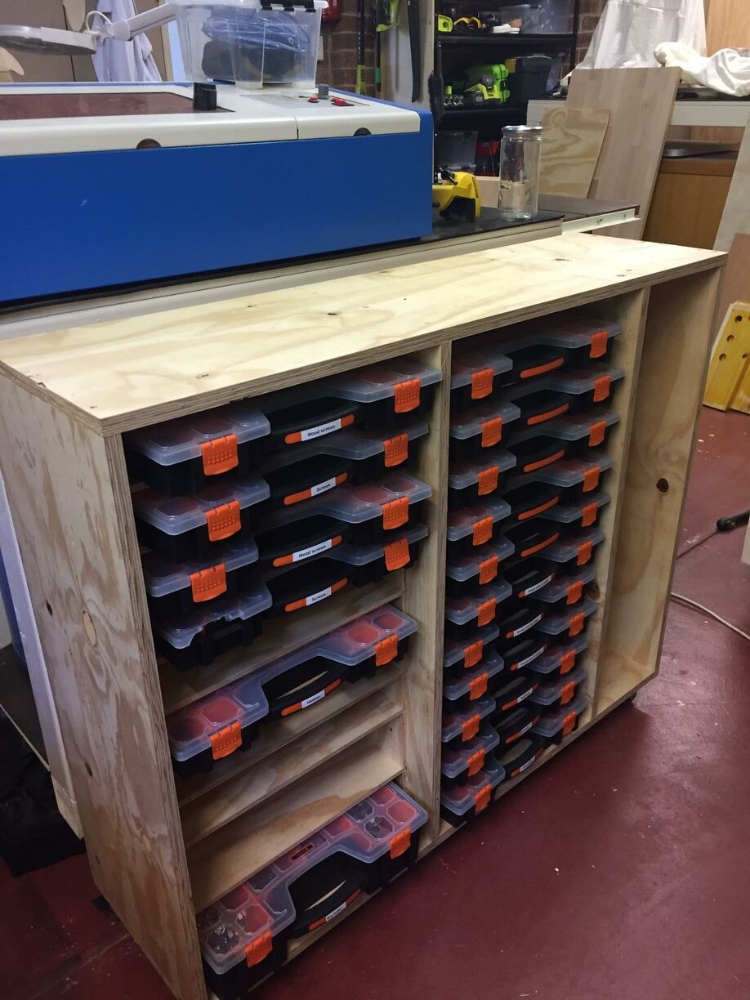

# Small parts box rack

Rack for my OCD parts boxen.

# Notes

1200x940x330mm 19mm ply coated with water based polyutherane applied with an
Ozito self-pressured spray-gun.

Shelves are build into the carcas with glued-in 7mm spacers that form rabbits
between them on which the 7mm ply shelves rest. No silly cut rabbits.

65mm 40kg coasters are used.
