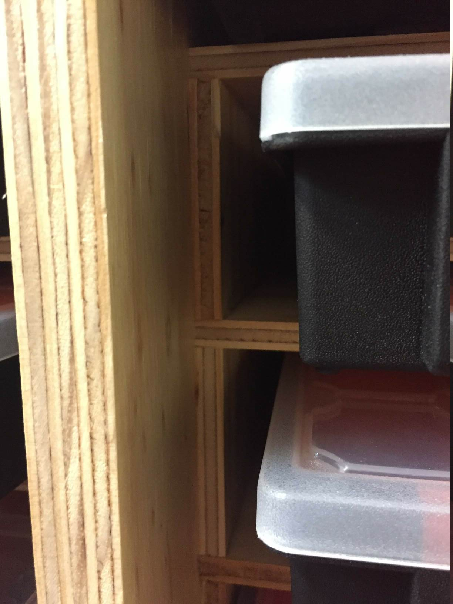
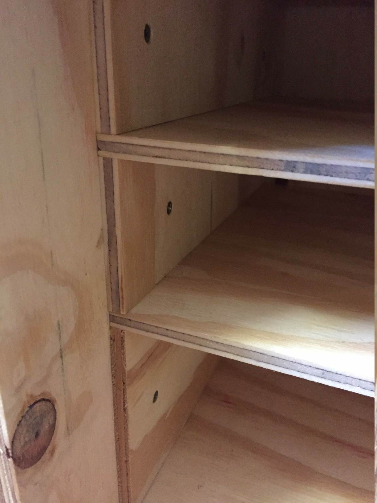
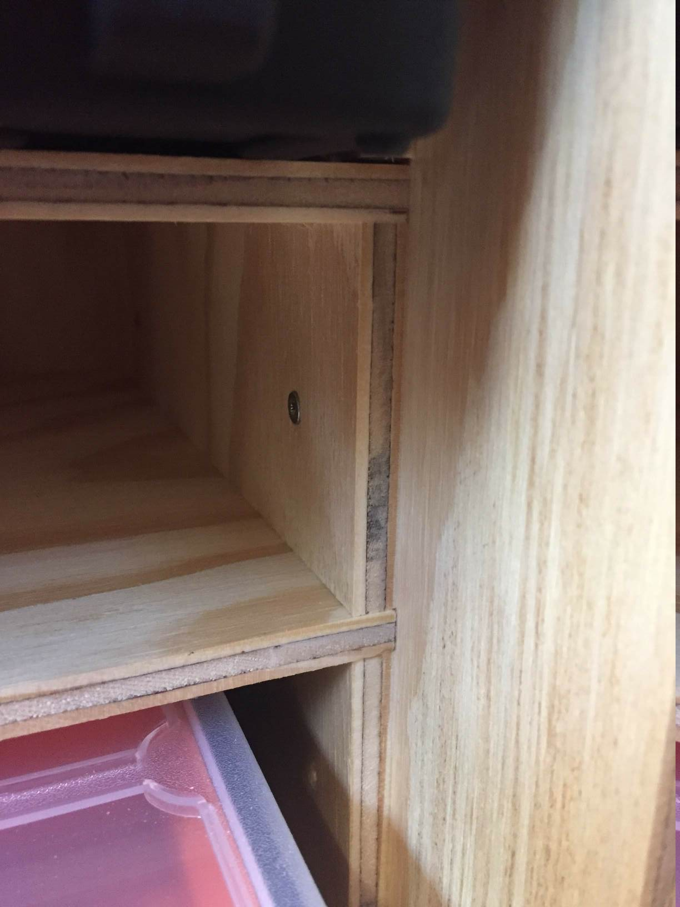

# Small parts box rack

Rack for my OCD parts boxen.

# Shelves

Shelves are build into the carcas with glued and screwed 7mm spacers that form rabbits
between which the 7mm ply shelves are bounded. No silly cut rabbits.

# Notes

1200x940x330mm 19mm ply coated with water based polyutherane applied with an
Ozito self-pressured spray-gun.

65mm 40kg coasters are used.
